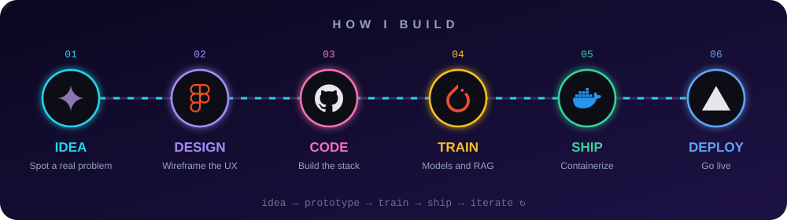

<p align="center">
  
</p>

<div align="center">


<br/><br/>


</div>

<br/>

<p align="center"><i>Building thoughtful software at the intersection of intelligence, design, and impact.</i></p>

<table align="center" width="100%">
<tr>
<td width="58%" valign="middle">

### 👋 Hi, I'm Gaurav

I'm a **Computer Science Engineering student** who loves building scalable software, **AI-powered apps** and real-world products. I work across the stack, from clean **web interfaces** to **backend APIs**, **databases**, **cloud deployments** and **machine learning systems**—always with a focus on useful, human-centered experiences.

```yaml
name:     Gaurav Rajbhar
role:     AI/ML Engineer · Web Developer
focus:    [Intelligent products, clean interfaces, reliable systems]
into:     [Cloud Computing, Open Source, Building things]
learning: [System Design, Advanced Backend, Cloud Deployment]
mantra:   "Code. Learn. Build. Repeat."
```

</td>
<td width="42%" align="center" valign="middle">


</td>
</tr>
</table>


<p align="center">
  
</p>


<h2 align="center">🎯 What I Do</h2>
<p align="center"><i>From first sketch to dependable deployment.</i></p>

<table align="center" width="100%">
<tr>
<td width="25%" align="center" valign="top">

### 🤖 AI / ML
Machine learning, computer vision and RAG-based AI apps.

</td>
<td width="25%" align="center" valign="top">

### 🌐 Web Dev
Fast, responsive full-stack apps with React, Next.js and APIs.

</td>
<td width="25%" align="center" valign="top">

### ☁️ Cloud
Containerising and deploying apps on modern cloud platforms.

</td>
<td width="25%" align="center" valign="top">

### 🛠️ Builder
Turning ideas into products people can actually use.

</td>
</tr>
</table>


<h2 align="center">⚙️ My Workflow</h2>
<p align="center"><i>Turning ambiguous ideas into simple, shippable systems.</i></p>

<p align="center">
  
</p>


<h2 align="center">🛠️ Tech Arsenal</h2>

<table align="center" width="100%">
<tr>
<td width="46%" valign="middle">

**🤖 AI / ML**<br/>
`PyTorch` `TensorFlow` `OpenCV` `scikit-learn` `pandas` `NumPy` `RAG` `Gemini API`

**🌐 Frontend**<br/>
`React` `Next.js` `HTML5` `CSS3` `Tailwind CSS` `Vite`

**⚙️ Backend**<br/>
`Node.js` `Express` `FastAPI` `REST APIs` `WebSockets` `JWT`

**🗄️ Databases**<br/>
`PostgreSQL` `MongoDB` `MySQL` `SQLite` `Redis`

**☁️ Cloud & DevOps**<br/>
`Docker` `GitHub Actions` `Vercel` `Netlify` `Firebase` `Supabase` `Linux`

**💻 Languages**<br/>
`Python` `Java` `C++` `C` `JavaScript` `TypeScript`

**🧰 Tools**<br/>
`Git` `GitHub` `VS Code` `Postman` `Figma`

</td>
<td width="54%" align="center" valign="middle">



</td>
</tr>
</table>


<h2 align="center">🚀 Featured Projects</h2>

<table align="center" width="100%">
<tr>
<td width="50%" valign="top">

#### 🌍 [Suraksha Setu](https://github.com/Lightrex7749/Suraksha-Setu)
*AI-powered Disaster Intelligence Platform*

Combines satellite data, weather monitoring, emergency alerts and predictive analytics, with RAG and image classification for faster disaster response.

🏆 **State Winner · National Finalist**, OpenAI × NextWave Buildathon


</td>
<td width="50%" valign="top">

#### 🎓 [AlumUnity](https://github.com/Lightrex7749/AlumUnity)
*Modern Alumni Management Platform*

Real-time chat, mentorship matching, job portal and AI-powered career intelligence, built with role-based access for every user type.

<br/><br/>


</td>
</tr>
<tr>
<td width="50%" valign="top">

#### 👗 [ClothyRec](https://github.com/Lightrex7749/ClothyRec)
*AI Fashion Stylist*

Recommends outfits using OpenCLIP embeddings and FAISS search, with YOLOv8 + MTCNN for clothing and skin-tone detection and Gemini API for styling tips.


</td>
<td width="50%" valign="top">

#### ⚡ [EnergiX](https://github.com/Lightrex7749/EnergiX)
*Adaptive CPU Scheduling Simulator*

Simulator focused on improving **power efficiency and performance** with adaptive CPU scheduling.

<br/><br/>


</td>
</tr>
<tr>
<td colspan="2" valign="top">

#### 🍽️ [Canteen Management System](https://github.com/Lightrex7749/Canteen-Management-System)
*A practical digital solution for food services*

Manages orders, inventory, payments and food services in one place.

</td>
</tr>
</table>


<h2 align="center">📈 GitHub Stats</h2>

<div align="center">


<br/>


</div>


<h2 align="center">🐍 Contribution Snake</h2>

<p align="center">
  <picture>
    <source media="(prefers-color-scheme: dark)" srcset="https://raw.githubusercontent.com/Lightrex7749/Lightrex7749/output/github-contribution-grid-snake-dark.svg">
    
  </picture>
</p>


<table align="center" width="100%">
<tr>
<td width="36%" align="center" valign="middle">


</td>
<td width="64%" valign="middle">

### 🌱 Currently Learning

- ⚙️ Advanced Backend Engineering
- 🏗️ System Design
- 🧠 Artificial Intelligence & Machine Learning
- 🧩 Data Structures & Algorithms
- ☁️ Cloud Deployment

### ⚡ Interests

🤖 AI · 🌐 Full Stack · ☁️ Cloud Computing · 📊 Machine Learning · 🚀 Open Source · 💻 Software Engineering

### ✨ How I Build

- Start with the user problem, not the technology.
- Keep interfaces simple and systems dependable.
- Learn quickly, ship intentionally and improve continuously.

</td>
</tr>
</table>

<h2 align="center">🤝 Let's Connect</h2>

<p align="center">Have an idea, a collaboration in mind, or simply want to talk tech? I would love to hear from you.</p>

<p align="center">
<a href="mailto:Gauravrajbhar2115@gmail.com"></a>
<a href="https://www.linkedin.com/in/gauravrajbhar00"></a>
<a href="https://x.com/RezZ7749"></a>
<a href="https://instagram.com/rezz_iing"></a>
</p>

<p align="center"><b>⭐ Thanks for visiting my profile!</b><br/><i>"Code. Learn. Build. Repeat."</i></p>


